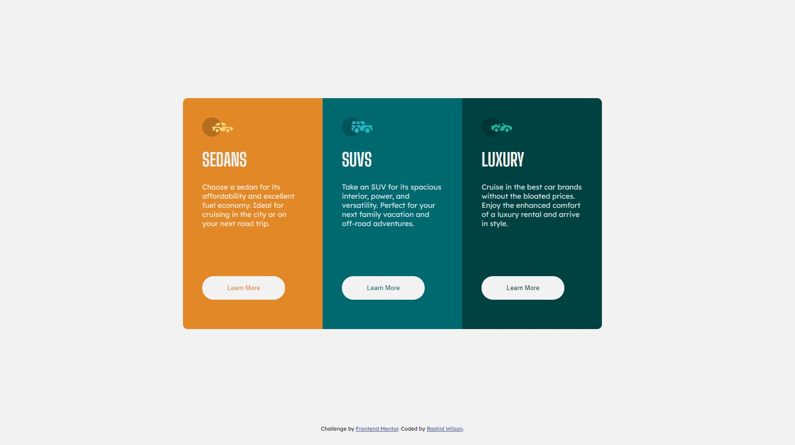

# Frontend Mentor - 3-column preview card component solution

This is a solution to the [3-column preview card component challenge on Frontend Mentor](https://www.frontendmentor.io/challenges/3column-preview-card-component-pH92eAR2-). Frontend Mentor challenges help you improve your coding skills by building realistic projects. 

## Table of contents

- [Overview](#overview)
  - [The challenge](#the-challenge)
  - [Screenshot](#screenshot)
  - [Links](#links)
- [My process](#my-process)
  - [Built with](#built-with)
  - [What I learned](#what-i-learned)
  - [Continued development](#continued-development)
  - [Useful resources](#useful-resources)
- [Author](#author)


## Overview

### The challenge

Users should be able to:

- View the optimal layout depending on their device's screen size
- See hover states for interactive elements

### Screenshot



### Links

- Solution URL: [Hosted By Github Pages](https://shangum.github.io/3-Column-Preview-Card-Component-Challenge-Frontend-Mentor/)

## My process

### Built with

- HTML
- CSS
- Flexbox

### What I learned

For this challenge I focussed on the follow:
    1) More Efficient css styling - I focussed on reducing the number of css classes that I usually use. I often have a habit of having many redundant classes in order to achieve the specified design specifications. One example of this was using the "inherit" value for the border radius of the individual cards (as seen in the css snippet below).
        
    2) Flexbox - I used flexbox to achieve the main layout of the design switching from flex direction row to column where necessary.

    3) Mobile/Tablet Styling - I got some practice utilizing media queries to implement a responsive design.

To see how you can add code snippets, see below:

```css
.card-container {
    display: flex;    
    justify-content: flex-start;
    flex-direction: row;   
    flex-wrap: wrap;     
    margin-left: auto;
    margin-right: auto;    
    padding: 200px 0 200px 0;
    border-radius: 10px;
    min-height: 480px;
    max-width: 870px;
}

.card-sedans {
    background-color: hsl(31, 77%, 52%);
    border-top-left-radius: inherit;
    border-bottom-left-radius: inherit;
}
```

### Continued development

I still plan on learning how to use CSS Grid but found I was able to complete this design with techniques that I was already familiar with.


### Useful resources

- [Font Face Assistance resource](https://www.smashingmagazine.com/2013/02/setting-weights-and-styles-at-font-face-declaration/) - This helped me to import and link multiple ttf files from the same font family
- [Flexbox Assistance](https://css-tricks.com/snippets/css/a-guide-to-flexbox/) - This was a useful flexbox reference guide.


## Author

- Website - [Rashid Wilson](NA)
- Frontend Mentor - [@shangum](https://www.frontendmentor.io/profile/shangum)

